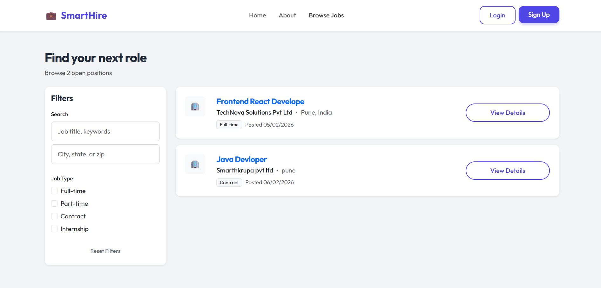
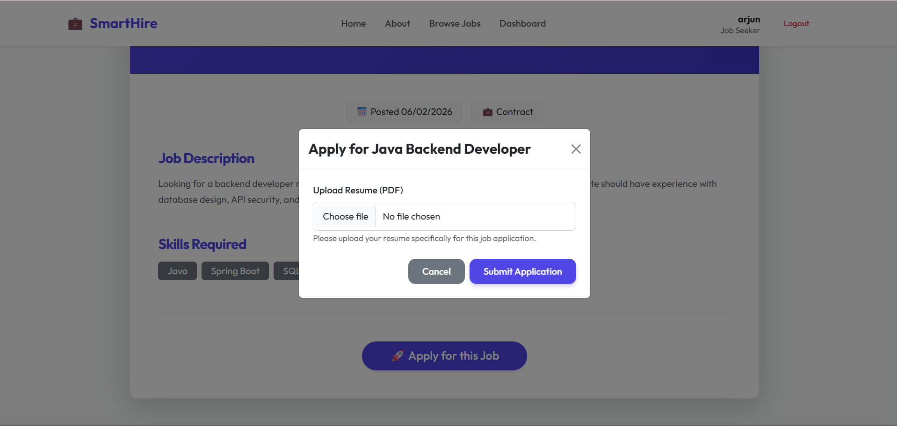
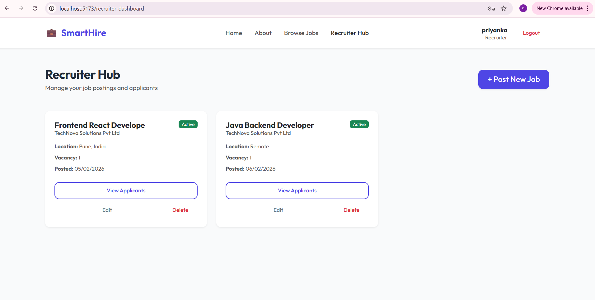
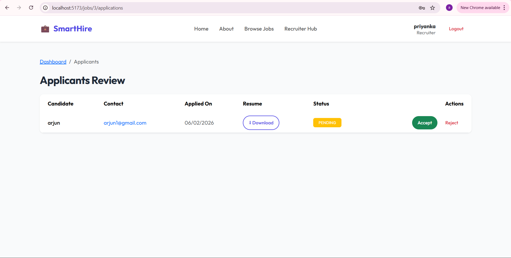
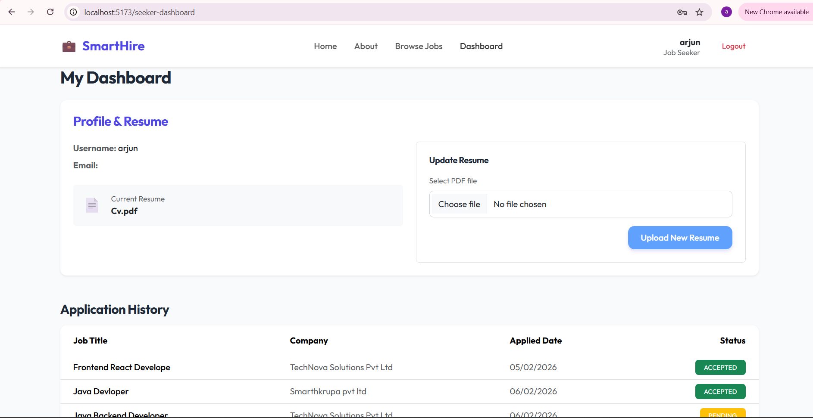

# 🚀 SmartHire Portal – Intelligent Job Recruitment Platform

> A modern SaaS-style recruitment platform built with **Spring Boot + React**  
> Designed as a real-world production system for job seekers and recruiters.

---


---

## ✨ Overview

SmartHire is a full-stack job recruitment platform where:

✔ Recruiters post and manage jobs  
✔ Candidates apply with resumes  
✔ Applications are tracked in real time  
✔ Secure authentication protects user data  

Built with scalable architecture and modern UI design — similar to real SaaS hiring platforms.

---

## 🚀 Key Features

### 👤 Job Seeker

- Secure signup & login (JWT authentication)
- Resume upload (PDF)
- Browse public job listings
- Apply to jobs instantly
- Track application status (Pending / Accepted / Rejected)
- Personal dashboard

---

### 🧑‍💼 Recruiter

- Post new job openings
- Edit/delete job listings
- View applicants per job
- Download candidate resumes
- Accept / Reject applications
- Recruiter management dashboard

---

### 🔐 System Features

- Role-based access control
- JWT authentication
- Secure password hashing (BCrypt)
- Resume file storage system
- Smart search engine
- REST API architecture
- Production-level error handling
- Responsive modern UI

---

## 🛠 Tech Stack

### Backend
- Java Spring Boot
- Spring Security
- JWT Authentication
- Hibernate / JPA
- REST APIs
- MySQL

### Frontend
- React.js
- Axios
- HTML / CSS / JavaScript

### Database
- MySQL (Database: `smarthire`)

---

## 📸 Screenshots

### 🏠 Homepage


### 🔎 Public Jobs Page


### 📝 Apply Job


### 🧑‍💼 Recruiter Dashboard


### ➕ Post New Job


### 📊 Applicants Review


### 📁 Job Seeker Dashboard


---

## ⚙ Installation Guide

### 1️⃣ Clone Repository

```
git clone https://github.com/yourusername/SmartHire-Portal.git
```

---

### 2️⃣ Backend Setup

```
cd backend
mvn spring-boot:run
```

---

### 3️⃣ Frontend Setup

```
cd frontend
npm install
npm run dev
```

---

### 4️⃣ Database Setup

Create database:

```
CREATE DATABASE smarthire;
```

Update credentials:

```
backend/src/main/resources/application.properties
```

```
spring.datasource.url=jdbc:mysql://localhost:3306/smarthire
spring.datasource.username=root
spring.datasource.password=@arjun001@
spring.jpa.hibernate.ddl-auto=update
```

---

## 📌 Project Purpose

This project demonstrates a production-level recruitment SaaS platform with:

- secure authentication
- recruiter workflow
- resume management
- real-world application architecture

Built for portfolio showcase, interviews, and professional demonstration.

---

## 👨‍💻 Author

**Arjun Ghadage**  
Full Stack Developer  
Java • Spring Boot • React • MySQL

---

⭐ If you like this project, consider giving it a star!
